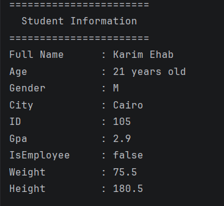

#  Day 01 - Kotlin Variables & Data Types

## Task Description
Make a playground with 10 variables of each type
and print formatted output using string templates.
---

##  What I Did
- I used (`var`) for variables that can change, and (`val`) for variables that can't.
- Declared and initialized different Kotlin data types.
- Utilizing **String Templates** (`$variable`) to format console outputs professionally.

---

## 📸 Output 
<!-- Replace 'output.png' with your actual screenshot filename later -->

---
