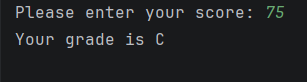
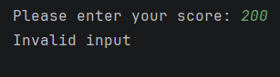
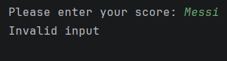

#  Day 02 - Grade calculator (When Expression )

##  Task Description
Build a "grade calculator" that maps a score to a
letter grade using when.
---

##  What I Did
- Used `when` expression for conditional logic.
- Used Kotlin **Ranges** (`in 90..100`) to check if a value falls within a specific interval .
- Handling user invalid input  `readln().toIntOrNull() ?: -1`.

---

##  Output 

---
