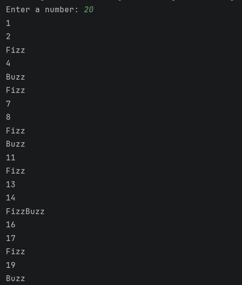
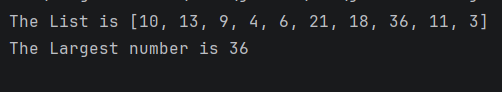

#  Day 03 - Kotlin Functions (FizzBuzz & Collection Operations)

## Task Description
Write functions for **FizzBuzz** and to **find the
largest number** in a list.
---

##  What I Did
- Write **Top-level functions** in Kotlin .
- Write the function call in a for loop to send numbers by order to the function.
- Using `when` expression to check the divisibility in FizzBuzz function and return the output.
- Sent the list in the function **parameters** to check the largest number.
- Find an easier alternative way than `for loop & if condtion ` to return the largest number 
which is`.maxOrNull()`.
---

## 📸 Output

---

---
