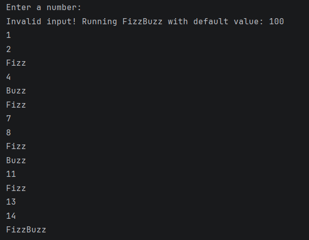
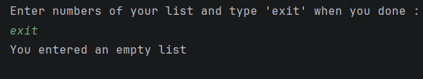

#  Day 04 - Kotlin Null Safety (Last Task Refactoring )

##  Task Description
Refactor yesterday's functions to safely handle
nullable/empty input with no crashes.
---

##  Key Achievements & Enhancements Today

### 1.FizzBuzz 
- Handled edge cases where the user inputs `null`, `text`, or numbers less than `1` by seamlessly falling back to a default value of `100` instead of breaking.

### 2. Largest number in the list
- Transformed the static list into a dynamic list by `mutableListOf<Int>()`.
- User input the numbers and when finish write (`"exit"`) keyword, using `while (true)` loop and `break` .
- if user entered a `letter` or `null` as an element msg will appear to invalid input .
- if list is empty the return will be `null` using `isNullOrEmpty` and handled with `if /else`.
---

##  Output 

\

---
