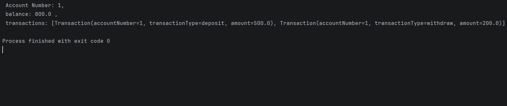

#  Day 06 - Classes & Data Classes (BankAccount)

## Task Description
Model a `BankAccount` class with
`deposit/withdraw` and a `Transaction data class`.
---

##  What I Did
- Created a **Data Class** named `Transaction` to hold immutable data for banking activities.
- Created a **Class** named `BankAccount` to handle the core business logic and account state.
- Created a `MutableList` of type `Transaction` inside the bank account class to start as an empty list for transactions.
- Implemented a `deposit` method to increase the balance.
- Implemented a `withdraw` method with an `if` condition to validate the balance first and safeguard against overdrafts before logging the transaction.
- Created a custom `print` function to output a clean and formatted dump of the current account details and transaction history.

---

## 📸 Output

---