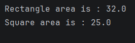

#  Day 07 - Inheritance, Abstract Classes & Interfaces 

## Task Description
Write a demo that proves `interface` vs `abstract
class`: model Shapes with area()
---

##   Abstract Class vs Interface

| Feature | Abstract Class                                   | Interface                                       |
| :--- |:-------------------------------------------------|:------------------------------------------------|
| **State (Variables)** | Can store state (holds actual fields/variables). | Cannot store state (no backing fields allowed). |
| **Constructor** | Can have a primary/secondary constructor.        | Cannot have any constructors.                   |
| **Inheritance** | A class can extend only **one** abstract class.  | A class can implement **multiple** interfaces.  |

---

##  What I Did
- Created an abstract class named `AbstractShape` to prove that it can hold state (`width` and `height` properties in the constructor) along with the abstract `area()` function.
- Created an interface named `InterfaceShape` containing only the `area()` function, proving that interfaces cannot have constructors or store variable values.
- Implemented a `Rectangle` class that extends `AbstractShape` and overrides the `area()` function.
- Implemented a `Square` class that implements `InterfaceShape` and provides its own properties (`side`) to compute the area.

---

## 📸 Output

---