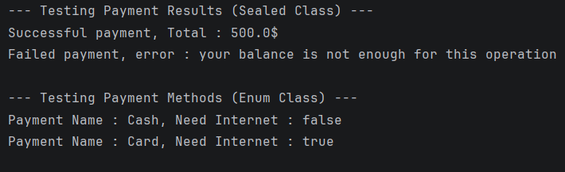

# Day 08 - Sealed Classes & Enums 

## Task Description
1. Model a **PaymentResult** `sealed class` (Success, Error, Pending) with associated data.
2. Create a **PaymentMethod** `enum class` (CASH, CARD, WALLET, BANK_TRANSFER) with properties
   (e.g., displayName and requiresInternet), then use a when expression to display information about each payment method.
---
##  What I Did
- Created a `PaymentResult` sealed class containing `Success` and `Failure` as data classes to hold associated data, and `Pending` as an object.
- Created a `PaymentMethod` enum class with all requested constants, attaching `displayName` and `requiresInternet` properties to each.
- Implemented handler functions using exhaustive `when` expressions to safely display specific details for each status and method.

---

##  Concepts Learned
- **Sealed Class for State Management:** Handled different dynamic results where each state requires different data types (e.g., `Success` needs `amount`, `Failure` needs an error message).
- **Enum Class for Fixed Configurations:** Grouped constant payment types with shared properties predefined at compile-time.
- **When Exhaustiveness:** Avoided default `else` branches entirely by satisfying the compiler that all structural types and enum options are fully covered.

---

## 📸 Output

---