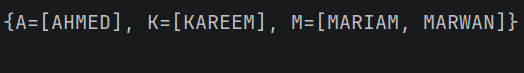

# Day 09 - Lambdas & Higher-Order Functions 

## Task Description
Transform a list of names: filter, uppercase, group
by first letter using HOFs.
---
##  What I Did
- Defined an initial list of names (`names`).
- Applied a chaining pipeline using Kotlin HOFs:
    - `.filter { it.length > 4 }` to keep long names.
    - `.map { it.uppercase() }` to standardize all names to uppercase.
    - `.groupBy { it.first() }` to aggregate the resulting names into a Map keyed by their initial character.

---

##  Concepts Learned
- **Lambda Expressions:** is an anonymous functions passed as arguments using standard and trailing lambda syntax.
- **Higher-Order Functions (HOFs):** Functions that accept other functions as parameters to or return it.
- **Collection Transformations:**  collection operations (`filter`, `map`, `groupBy`) to manipulate datasets without imperative loops.

---

## 📸 Output

---