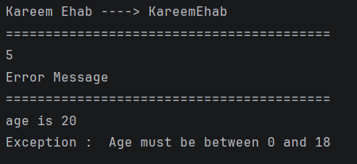

# Day 10 - Extension Functions, Generics & Custom Exceptions

## Task Description
- Add extension functions on String.
- Write a generic `Result<T>` wrapper with success/error .
- Create a custom `InvalidAgeException` and throw it if the age is less than 18, then catch the exception and print a user-friendly error message.

---

##  What I Did
- Created an Extension Function on `String` (`removeSpaces()`) to remove whitespace from any string instance.
- Built a Generic `Result<T>` sealed class wrapper to handle `Success` and `Error` states safely.
- Defined a custom exception class `InvalidAgeException` inheriting from `Exception`.
- Implemented a `checkAge()` function using `try-catch` expression to validate user age and handle custom exception .

---

##  Concepts Learned
- **Extension Functions:** Ability to extend a class with new functionality without modifying its original source code.
- **Generics (`<T>`):** Writing flexible and reusable code components that work across different data types safely.
- **Custom Exceptions & Try-Catch Expressions:** Throwing domain-specific exceptions and using `try-catch` as expressions to return values directly upon catching errors.
- **Sealed Classes :** Restricting class hierarchies to represent clear success and failure outcomes.

---

## 📸 Output

---