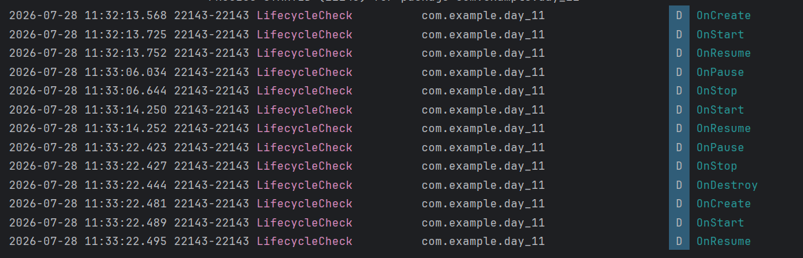

# Day 11 - How an Android App Works (Activity Lifecycle)

## Task Description
- Create a new project, add a log statement in each lifecycle callback, and observe them in Logcat as you `rotate` the screen and `background` the app.

---

##  What I Did
- Overrode all major Activity lifecycle callback functions in `MainActivity`.
- Used `Log.d("LifecycleCheck", ...)` to observe and print distinct messages for every callback.
- Tested state transitions (navigating home, rotating screen, terminating app) and tracked state logs using Logcat.

---

##  Observations
- **When app opens:** `onCreate` ➔ `onStart` ➔ `onResume`.
- **When backgrounding the app:** `onPause` ➔ `onStop` | **And when returning:** `onStart` ➔ `onResume`.
- **When screen rotates:** `onPause` ➔ `onStop` ➔ `onDestroy` ➔ `onCreate` ➔ `onStart` ➔ `onResume`.
- **When killing the app (Activity):** `onPause` ➔ `onStop` ➔ `onDestroy`.

---

## 📸 Output

---