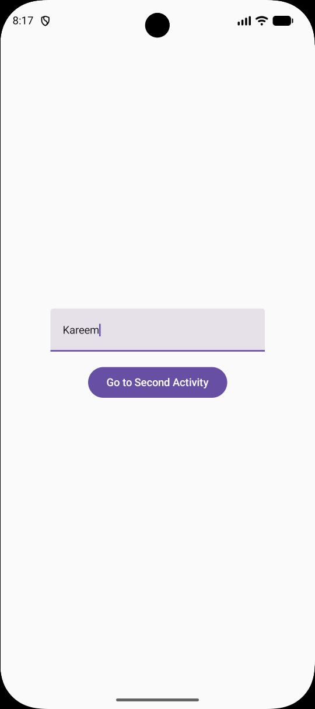

# Day 12 - Activities & Intents

## Task Description
Build a `two-screen app`: Screen 1 has a 
name TextField + button → Screen 2 
displays "Hello, [name]" — data passed 
via `Intent`. 

---

##  What I Did
- Created two distinct Activities: `MainActivity` (Screen 1) and `SecondActivity` (Screen 2).
- Built the UI using Jetpack Compose with a state-managed `TextField` and a navigation `Button`.
- Used `LocalContext.current` to access the Activity Context inside a Composable function.
- Implemented an **Explicit Intent** to handle navigation from `MainActivity` to `SecondActivity`.
- Passed the entered name using `intent.putExtra("USER_NAME", name)` and retrieved it in the second screen using `intent.getStringExtra()`.
- Declared and configured `SecondActivity` inside `AndroidManifest.xml`.

---

##  Concepts Learned
- **Explicit vs Implicit Intents:** Understanding when to target a specific class within the app vs delegating actions to external system apps.
- **Data Passing with Extras:** How to bundle key-value pairs using `putExtra()` and retrieve them with `getStringExtra()` (with default fallback values).
- **Context in Jetpack Compose:** Understanding when to use Activity Context (`this`) vs `LocalContext.current` inside Composables.
- **State Management:** Using `remember` and `mutableStateOf` to observe and capture dynamic input values from a `TextField`.

---

## 📸 Output

---