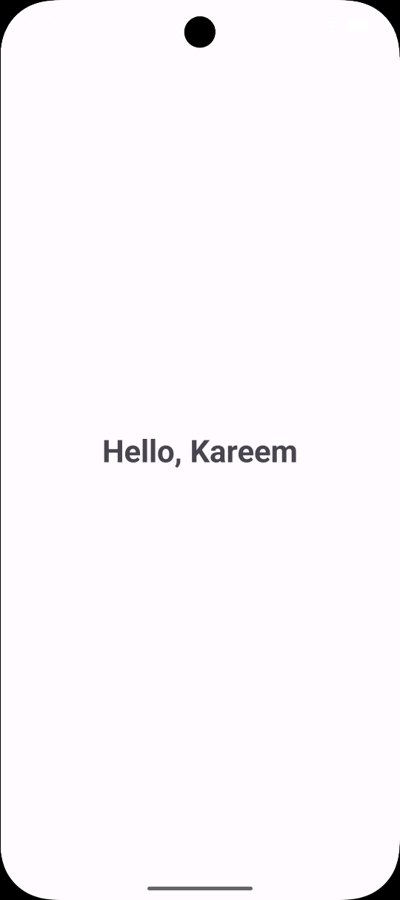

# Day 13 - XML Layouts & Views

## Task Description
Rebuild the `two-screen app` from Day 12 using XML layouts + View Binding instead of Jetpack Compose code. Compare the two approaches in your README.

---

## 🛠️ What I Did
- Recreated the UI for both `MainActivity` and `SecondActivity` using classical XML layouts (`LinearLayout`).
- Enabled **View Binding** in `build.gradle.kts` to interact safely with XML components.
- Replaced `findViewById` calls with generated binding classes (`ActivityMainBinding` and `ActivitySecondBinding`).
- Implemented inflation using `ActivityMainBinding.inflate(layoutInflater)` and set the root view via `setContentView(binding.root)`.
- Extracted user input from `EditText` and passed it via `Intent` extras, displaying `"Hello, [name]"` (or default fallback) in a `TextView` on the second screen.

---

##  Concepts Learned
- **View Binding:** How it automatically generates binding objects for each XML layout to provide type-safe and null-safe view references.
- **Layout Inflation:** Understanding how `layoutInflater` transforms static XML hierarchy into active memory objects (Views).

- **XML vs Jetpack Compose Comparison:** Understanding the imperative state management of XML views versus the declarative UI paradigm of Compose.

---

##  XML vs. Jetpack Compose

| Feature | XML                                                                 | Jetpack Compose |
| :--- |:--------------------------------------------------------------------| :--- |
| **UI Paradigm** | Imperative (You explicitly find & modify UI elements step-by-step). | Declarative (You describe how the UI looks based on current state). |
| **Language** | Dual-language (XML for Layouts + Kotlin for Logic).                 | Pure Kotlin (UI & Logic written seamlessly together). |
| **State Handling** | Manual update required (`binding.textView.text = newText`).         | Automatic UI update via Recomposition when state changes (`remember`, `mutableStateOf`). |
| **Safety & Overhead** | Requires generated binding classes to avoid `NullPointerException`. | Built-in compile-time safety directly in Kotlin code. |
| **Code Base Size** | More boilerplate code (layout files, inflations, binding setup).    | Significantly less boilerplate code (~60% reduction). |

---

## 📸 Output

---