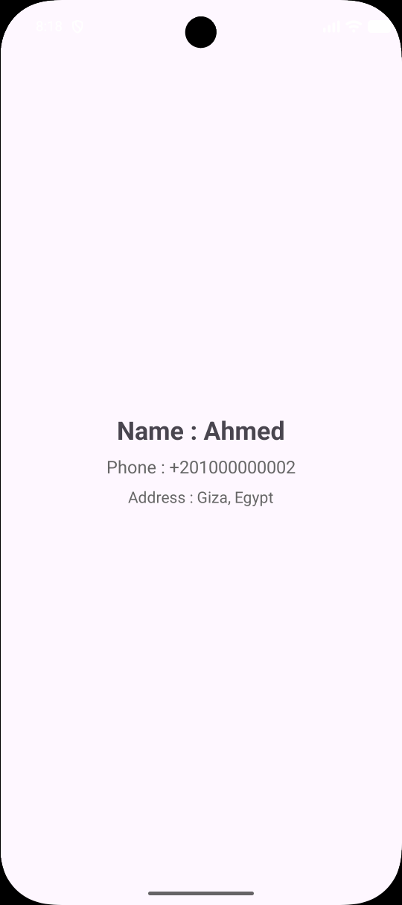

# Day 14 - RecyclerView & Adapters

## Task Description
- Build a scrollable contact list using 
`RecyclerView` + a `data class`. Tap a row to 
open a `detail Activity`.

---

##  What I Did
- Designed an XML item layout (`item_student.xml`) to structure each row in the student list.
- Created a custom `StudentAdapter` extending `RecyclerView.Adapter` to manage data binding and view holder inflation.
- Implemented the **ViewHolder** to cache view references and optimize memory usage during scrolling.
- Configured a item click listener to handle row selection events cleanly.
- Set up `LinearLayoutManager` on `RecyclerView` inside `MainActivity` to render a vertical scrollable list.
- Navigated to `DetailActivity` on row tap, passing student properties (`id`, `age`) via `Intent` extras and displaying them on the detail screen.

---

##  Concepts Learned
- **ViewHolder Pattern:** How caching view references prevents frequent calls to `findViewById` / inflation, providing smooth scrolling performance.
- **RecyclerView Lifecycle:** The inner workings of `onCreateViewHolder` (layout inflation) and `onBindViewHolder` (binding data per position).
- **Recycling Mechanism:** How views scrolling off-screen are reused for new items entering the viewport rather than recreated.
- **Item Click Callbacks:** Decoupling UI presentation from event logic by passing click callbacks from the Activity to the Adapter.

---

## 📸 Output

---