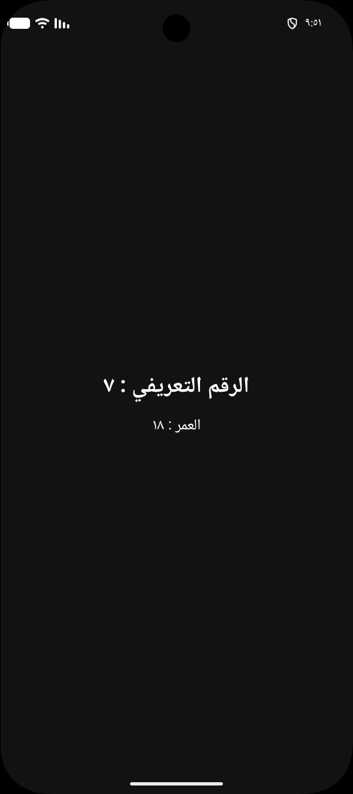
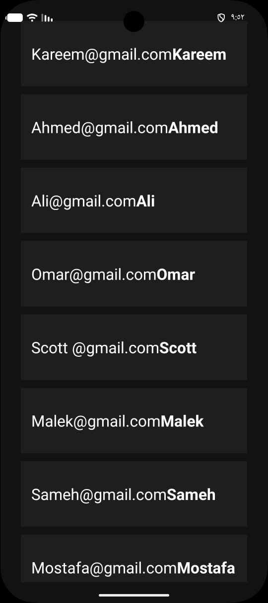

# Day 15 - Resources, Localization & Dark Mode

## Task Description
- Add `dark-mode` colors, move all 
hardcoded strings to strings.xml, and add 
a `second language` (Arabic) to your 
contact list app.

---

##  What I Did
- Extracted all hardcoded UI text and string concatenations into `res/values/strings.xml` using dynamic placeholders (`%1$d`, `%1$s`).
- Created an Arabic localization resource file (`res/values-ar/strings.xml`) to provide complete Arabic language support.
- Implemented Dark Mode color palettes by creating a dedicated night resource directory (`res/values-night/colors.xml`).

---

##  Concepts Learned
- **String Placeholders:** How to safely pass dynamic runtime parameters (`ID`, `Age`) to string resources via `getString(R.string.id_format, id)` without UI text hardcoding.
- **Localization & Qualifiers:** How Android automatically resolves resources at runtime based on system device locale (`values-ar` vs `values`).
- **Dark Theme Adaptation:** Managing theme colors dynamically across system modes using `values-night` qualifiers.

---

## 📸 Output

---