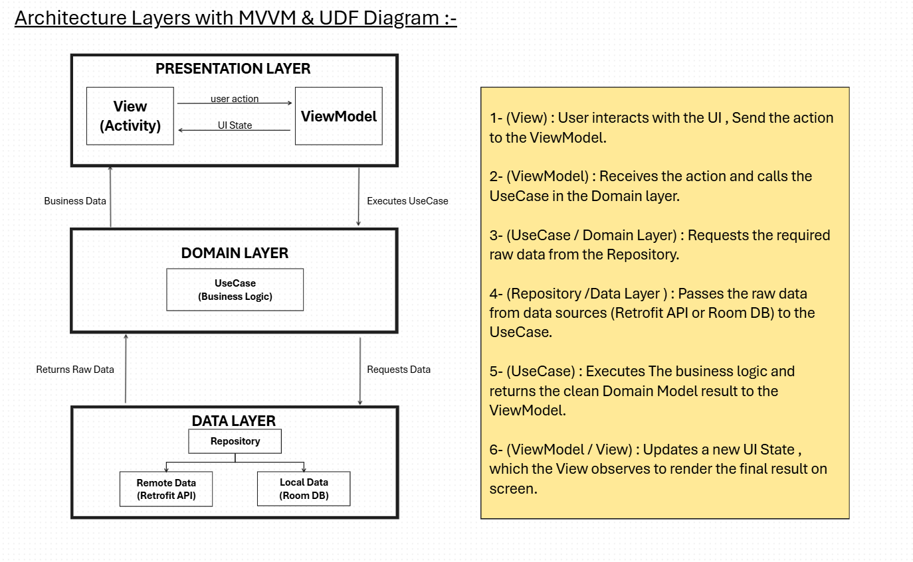

#  Day 15 -  MVVM Architecture & Unidirectional Data Flow (UDF)

## 1. MVVM (Model-View-ViewModel)
- **View (Activity/Fragment):** Responsible only for rendering the UI and receiving user input. It has **no business logic** and observes state changes from the ViewModel.
- **ViewModel:** Acts as a mediator between the View and theData layers. It holds and manages UI-related data in a lifecycle-conscious way `(survives configuration changes)`.
- **Model (Domain & Data Layers):** Contains the business rules (`UseCases`) and handles raw data operations (`Repository`, `API`, `Room DB`).

## 2. Unidirectional Data Flow (UDF)
- **Concept:** Data flows strictly in **one single direction** across the app to prevent inconsistent UI states and make debugging easier.
- **Flow Cycle:**
  1. **User Action:** The View sends user inputs/events to the ViewModel.
  2. **Business Execution:** The ViewModel triggers the appropriate `UseCase` in the Domain layer.
  3. **Data Fetching:** The Domain layer calls the `Repository` in the Data layer to fetch raw data.
  4. **State Update:** The ViewModel processes the result and updates the **UI State**.
  5. **UI Rendering:** The View observes the immutable UI State and updates the screen accordingly.

---

## 📐 Architecture Diagram

