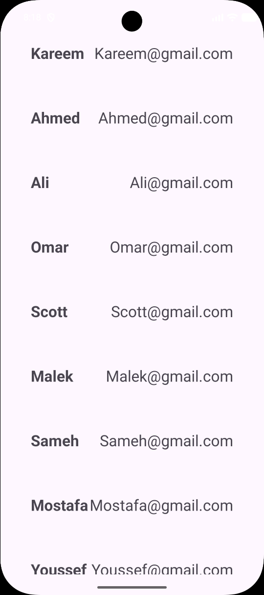

# Day 17 - ViewModel & StateFlow

## Task Description
- Refactor the Contact List app by extracting all business logic into a `ViewModel` that exposes a `StateFlow<List<Contact>>`. 
- Ensure the `Activity` strictly observes data state changes with zero business logic implemented within it.

---

##  What I Did
- Created `ContactViewModel` inheriting from `ViewModel` to encapsulate data state and retain it across configuration changes (e.g., screen rotation).
- Implemented state encapsulation using a `private` `MutableStateFlow` and exposed a read-only `StateFlow` to prevent direct modification from the UI layer.
object payload via `Intent`.
- Refactored `MainActivity` into a passive view layer that strictly consumes data state and handles UI bindings.

---

##  Concepts Learned
- **ViewModel Lifecycle:** How `ViewModel` instances survive configuration changes (like rotation) via `ViewModelStore` and only clear when the host scope finishes.
- **StateFlow & Encapsulation:** Utilizing `MutableStateFlow` for internal updates and exposing standard `StateFlow` as read-only state representation (Exposure Pattern).
- **MVVM Architecture:** Decoupling business logic from UI components, making `Activity` a purely reactive UI component.

---

##  Output

---