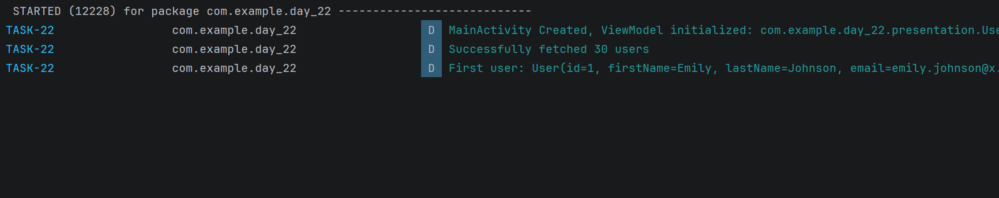

# Day 22 - Retrofit & OkHttp 

## Task Description
- Fetch raw data from a public API and print the
parsed response to Logcat inside a ViewModel.
---

## What I Did
- Defined the network contract in `ApiService` using Retrofit annotations (`@GET("users")`) to handle HTTP request/response mapping.
- Configured `Retrofit.Builder` integrated with `GsonConverterFactory` for automatic JSON-to-Object serialization.
- Executed non-blocking network calls using Kotlin Coroutines on `Dispatchers.IO` inside `viewModelScope`, ensuring zero main-thread freezing.
- Added comprehensive logging (`Log.d` / `Log.e`) and error handling (`try-catch` & `printStackTrace`) to inspect HTTP responses and trace network exceptions.

---

## Concepts Learned
- **Retrofit & REST APIs:** Learned how Retrofit dynamically generates HTTP requests, maps endpoints, and converts JSON responses into type-safe Kotlin objects.
- **OkHttp Engine:** Understood how Retrofit relies on OkHttp for underlying network transport, connection pooling, and handling network security protocols.
- **Network Threading & Asynchronous Calls:** Managed background network execution on `Dispatchers.IO` to ensure smooth UI responsiveness during API calls.

---

## 📸 Output

